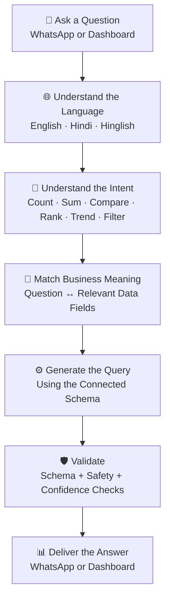

<div align="center">

<br/>

```text
██████╗  █████╗ ████████╗ █████╗ ███████╗ █████╗  █████╗ ████████╗██╗  ██╗██╗
██╔══██╗██╔══██╗╚══██╔══╝██╔══██╗██╔════╝██╔══██╗██╔══██╗╚══██╔══╝██║  ██║██║
██║  ██║███████║   ██║   ███████║███████╗███████║███████║   ██║   ███████║██║
██║  ██║██╔══██║   ██║   ██╔══██║╚════██║██╔══██║██╔══██║   ██║   ██╔══██║██║
██████╔╝██║  ██║   ██║   ██║  ██║███████║██║  ██║██║  ██║   ██║   ██║  ██║██║
╚═════╝ ╚═╝  ╚═╝   ╚═╝   ╚═╝  ╚═╝╚══════╝╚═╝  ╚═╝╚═╝  ╚═╝   ╚═╝   ╚═╝  ╚═╝╚═╝
```

### **Your Business Data. Your Language. Wherever You Are.**

**Ask questions about your business in English, Hindi, or Hinglish - and get clear answers directly on WhatsApp or the DataSaathi dashboard.**

<br/>

[](https://datasaathi.com)
[](https://datasaathi.com)
[](https://datasaathi.com)

<br/>

**No SQL to write. No complicated dashboards to learn. Just ask.**

<br/>

</div>

---

## 🎬 See DataSaathi in Action

<div align="center">

### [▶ Watch the DataSaathi Demo](https://drive.google.com/file/d/112B9FkOior4IcvXUKJKBiMMc7dL9Teyi/preview)

*See how a simple business question turns into an answer from real business data.*

</div>

---

## ✈️ Your Business Doesn't Stop When You Leave Your Laptop Behind

Imagine this.

You run a growing distribution business.

Your customer records, invoices, sales numbers, outstanding payments, and operational data are stored in your CRM or business database.

You're travelling for an important business meeting.

Your laptop isn't with you.

Then someone asks:

> **“Which customers currently have the highest outstanding payments?”**

Normally, you might have to call your accountant, contact someone from your office, open a laptop later, or wait for somebody to prepare the information.

With **DataSaathi**, you simply open WhatsApp.

```text
        ✈️  Business Owner Travelling
                     │
                     ▼
              📱 Opens WhatsApp
                     │
                     ▼
      "Top 5 customers with outstanding
            payments this month?"
                     │
                     ▼
              🧠 DataSaathi
          Understands the question
                     │
                     ▼
       🔍 Finds the relevant business data
                     │
                     ▼
            📊 Clear Answer
           directly on WhatsApp
```

No laptop.

No SQL.

No searching through spreadsheets.

No waiting for someone to prepare a report.

**Your business data becomes accessible through a conversation.**

---

## 💡 The Problem DataSaathi Solves

Businesses generate enormous amounts of useful data every day.

The problem is that **having data and being able to use it are two different things.**

Important information may be sitting inside:

* spreadsheets,
* databases,
* CRMs,
* accounting systems,
* ERPs,
* sales systems,
* or operational tools.

But answering even a simple business question can still require someone to:

1. open the right system,
2. locate the correct data,
3. understand the fields,
4. apply filters,
5. prepare a report,
6. and explain the result.

For a business owner, the real question is much simpler:

> **“Why can't I just ask my data?”**

### DataSaathi makes that possible.

---

## 💬 Ask Naturally. Get Business Answers.

You don't need to know database column names.

You don't need to write perfect English.

You don't need to understand how the data is structured.

Just ask naturally.

```text
┌──────────────────────────────────────────────────────────────┐
│ 💬 WhatsApp · DataSaathi                                     │
├──────────────────────────────────────────────────────────────┤
│                                                              │
│ You:      पिछले महीने सबसे ज़्यादा बिकने वाले products कौन से थे?         │
│                                                              │
│ Saathi:   📊 Last month's top 3 products:                    │
│           1. Product A  — ₹2,41,800                          │
│           2. Product B  — ₹1,93,500                          │
│           3. Product C  — ₹1,31,200                          │
│                                                              │
│ You:      Which stores missed their target this week?        │
│                                                              │
│ Saathi:   ⚠️ 3 stores are below target:                      │
│           • MG Road       — 18% below target                 │
│           • Koregaon Park — 9% below target                  │
│           • Kothrud       — 4% below target                  │
│                                                              │
│ You:      June mein kitne return invoices aaye?              │
│                                                              │
│ Saathi:   📋 247 return invoices                             │
│           Total value: ₹8,34,600                             │
│                                                              │
└──────────────────────────────────────────────────────────────┘
```

> **Business intelligence shouldn't require technical language.**

---

## ✨ What Makes DataSaathi Different

| 🗣️ **Speak Naturally**                                      | 🧩 **Understands Meaning**                                                        | 📱 **Works Where You Work**                                                     |
| ------------------------------------------------------------ | --------------------------------------------------------------------------------- | ------------------------------------------------------------------------------- |
| Ask in English, Hindi, Hinglish, or naturally mix languages. | Understands business terminology, aliases, spelling variations, and common typos. | Ask through WhatsApp or use the web dashboard. No separate mobile app required. |

| 🔒 **Safe by Design**                                                                             | 🏢 **Built for Business Data**                                                | 📊 **Context-Aware Answers**                                                         |
| ------------------------------------------------------------------------------------------------- | ----------------------------------------------------------------------------- | ------------------------------------------------------------------------------------ |
| Read-oriented access, query validation, tenant isolation, authentication, and webhook protection. | Works across different business domains and adapts to the schema you connect. | Questions are interpreted using the context and structure of your own business data. |

---

## 🧠 More Than Just a Chatbot

DataSaathi doesn't simply forward your message to an AI model.

Behind every question is a multi-stage intelligence pipeline designed specifically for **business-data understanding**.



### For example...

Your database might contain:

```text
Customer_Name
Return_Bills
Total_Sales
Outstanding_Amount
```

But your users may ask:

```text
"grahak"
"return bills"
"totl sales"
"pending amount"
```

DataSaathi's semantic layer helps connect the **way people speak** with the **way business data is stored**.

---

## 📊 What Can You Ask?

DataSaathi is designed for everyday business questions—not only predefined dashboards.

| Business Area      | Example Question                                         |
| ------------------ | -------------------------------------------------------- |
| 💰 **Sales**       | “Which products generated the highest sales this month?” |
| 📉 **Performance** | “Which stores are below target?”                         |
| 💳 **Collections** | “Who are our top customers by outstanding amount?”       |
| 📦 **Products**    | “Which products are moving slower than last month?”      |
| 🧾 **Invoices**    | “How many return invoices were generated in June?”       |
| 📈 **Trends**      | “Compare this month's sales with last month.”            |
| 👥 **Customers**   | “Who are our top 10 customers by revenue?”               |
| 🏢 **Branches**    | “Which branch performed best this quarter?”              |

The available questions depend on the data connected to DataSaathi.

---

## 🌍 Designed for Different Businesses

DataSaathi adapts to the **schema and terminology of the business**, rather than assuming every organization stores information in exactly the same way.

| 🏭 FMCG & Distribution    | 🛒 Retail & Chains     | 🏥 Healthcare        |
| ------------------------- | ---------------------- | -------------------- |
| Invoice & return tracking | Store-wise performance | Appointment analysis |
| Distributor analytics     | Target performance     | Doctor-wise analysis |
| Product movement          | Campaign insights      | Revenue by service   |

| 💰 Finance & Accounting   | 🏗️ Manufacturing     | 🎓 Education            |
| ------------------------- | --------------------- | ----------------------- |
| Outstanding & collections | Production output     | Enrollment & attendance  |
| Client-wise summaries     | Defect analysis       | Fee collection          |
| Cash-flow visibility      | Efficiency comparison | Course-wise performance |

---

## 📱 Why WhatsApp Matters

Business owners don't always work from a desk.

They may be:

* travelling,
* visiting a client,
* attending an exhibition,
* meeting a distributor,
* moving between branches,
* working from a warehouse,
* or simply away from their laptop.

Yet business questions still come up.

DataSaathi turns WhatsApp into a conversational window into business data.

```text
Traditional Flow

Question
   ↓
Call someone
   ↓
Explain requirement
   ↓
Open system
   ↓
Prepare report
   ↓
Send screenshot / Excel
   ↓
Interpret result


DataSaathi Flow

Question
   ↓
WhatsApp
   ↓
Answer
```

The goal isn't to replace every analytics dashboard.

The goal is to make **everyday business answers dramatically easier to reach**.

---

## 🔌 Connect Your Business Data

### ✅ Available

| Data Source                   | Support      |
| ----------------------------- | ------------ |
| 📊 Google Sheets              | ✅ Available |
| 📁 Microsoft Excel (`.xlsx`)  | ✅ Available |
| 🐬 MySQL                      | ✅ Available |
| 🐘 PostgreSQL                 | ✅ Available |


### 🔜 On the Roadmap

| Integration              | Status     |
| ------------------------ | ---------- |
| WebEngage                | 🔜 Planned |
| MoEngage                 | 🔜 Planned |
| CleverTap                | 🔜 Planned |
| Zoho Books               | 🔜 Planned |
| QuickBooks Online        | 🔜 Planned |
| SAP Business One         | 🔜 Planned |
| Shopify                  | 🔜 Planned |
| BUSY / Marg ERP          | 🔜 Planned |
| TallyPrime / Tally ERP 9 | 🔜 Planned |
| Custom REST APIs         | 🔜 Planned |

> The integration roadmap may evolve as DataSaathi grows.

---

## 🛡️ Your Business Data Deserves Protection

DataSaathi is designed with safeguards around how business data is accessed and queried.

```text
              🔐 Encrypted Credentials
                       │
                       ▼
              🚫 Read-Oriented Access
                       │
                       ▼
              🛡️ Query Validation
                       │
                       ▼
              👥 Tenant Isolation
                       │
                       ▼
              ✅ Verified Webhooks
                       │
                       ▼
                 📊 Your Answer
```

Key application-level controls include:

* 🔐 **Encrypted connector credentials**
* 🚫 **Read-oriented access model**
* 🛡️ **Schema-aware query validation**
* ✅ **WhatsApp webhook signature verification**
* ⏱️ **API rate limiting**
* 👥 **Tenant-level application isolation**
* 🔑 **JWT-based authenticated access**

---

## 🛠️ What's Behind DataSaathi?

For non-technical users, DataSaathi is simply:

> **Ask → Understand → Analyse → Answer**

For the technically curious:

<details>
<summary><strong>⚙️ View the Technology Stack</strong></summary>

<br/>

| Layer                      | Technologies                                                                  |
| -------------------------- | ----------------------------------------------------------------------------- |
| 🧠 **AI & Intelligence**   | Claude API (Anthropic) · Semantic NL→SQL · Vector Embeddings · Fuzzy Matching |
| ⚙️ **Backend**             | Java 21 · Spring Boot 3.5                                                     |
| 🗄️ **Data**                | PostgreSQL · Redis                                                            |
| 🔐 **Security**            | JWT-based application security                                                |
| 💻 **Frontend**            | React 18 · TypeScript · Tailwind CSS                                          |
| 📊 **Visualization**       | Recharts                                                                      |
| ✨ **UI Motion**           | Framer Motion                                                                 |
| 💬 **Messaging**           | WhatsApp Business Platform (Meta)                                             |
| 📄 **Data Processing**     | Google Sheets API · Apache POI                                                |
| 🔄 **Database Migrations** | Flyway                                                                        |
| ⏱️ **Scheduling**          | Quartz Scheduler                                                              |
| 🏢 **Architecture**        | Multi-tenant SaaS                                                             |

<br/>

</details>

---

## 🚀 Product Status

**DataSaathi is currently in active rollout.**

The mission is simple:

### Make business data easier to access for the people who actually need it.

Not only analysts.

Not only developers.

Not only people sitting in front of dashboards.

But also the business owner asking an important question from their phone while travelling hundreds of kilometres away from the office.

---

## 📬 Get in Touch

Interested in **DataSaathi**, want to explore a business use case, discuss a potential integration, or have a question about the project?

<div align="center"> **Feel free to connect.** </div>

<div align="center">

<br/>

## **Your business already has the data.**

### **DataSaathi helps you have a conversation with it.**

<br/>

<div align="center">

[](https://drive.google.com/file/d/112B9FkOior4IcvXUKJKBiMMc7dL9Teyi/preview)
[](https://www.linkedin.com/in/tanish-pophale/)
[](mailto:tanishpophale@gmail.com)

</div>

<br/><br/>

**Helping Indian businesses ask better questions - in their own language.**

<br/>

</div>
